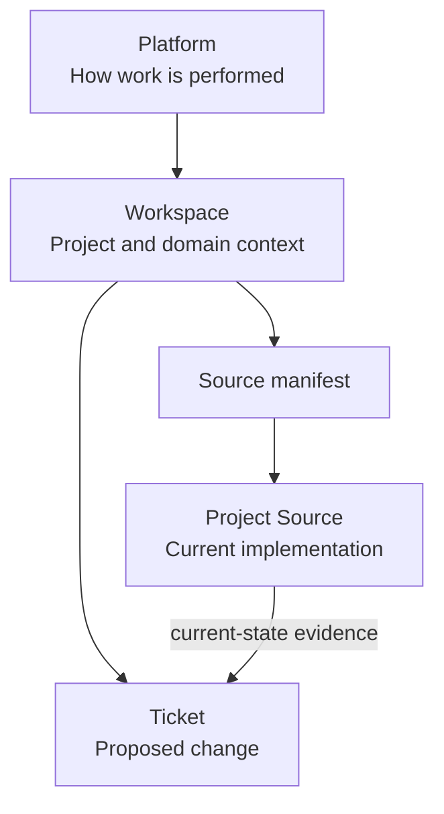
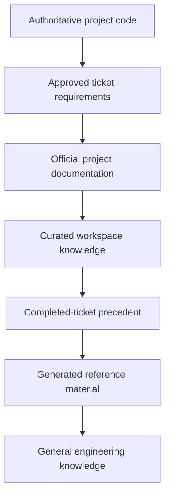
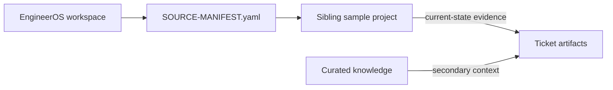
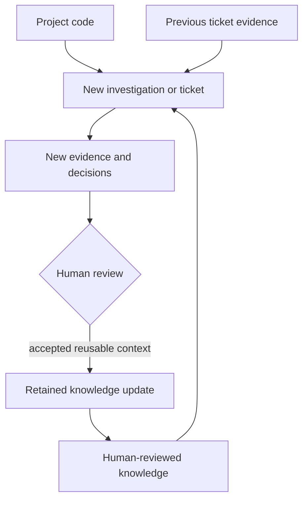

# Architecture and Mental Model

EngineerOS is not merely a ticket template system. It is a persistent
engineering context and workflow layer around separately located project
repositories.

| Layer | Meaning |
|---|---|
| Platform | **How** AI-assisted engineering is performed: authority, evidence, safety, modes, and checkpoints |
| Workspace | **What** project/domain context the agent receives: instructions, manifest, knowledge, and tickets |
| Project Source | **What** the software currently implements; authoritative for current behavior |
| Ticket | **What change** is being understood, designed, proposed, validated, reviewed, and handed off |

The repository separates four concerns:

1. **Platform governance** — global evidence, safety, and approval rules under
   `EngineerOS/platform/` and `EngineerOS/workflows/`.
2. **Workspace context** — fictional domain-specific instructions and knowledge
   under `EngineerOS/workspaces/<workspace>/`.
3. **Sample projects** — runnable synthetic source code under
   `Sample-Projects/<project>/`, alongside rather than inside EngineerOS.
4. **Ticket workspaces** — isolated analysis, design, proposed changes, tests,
   review, and release guidance under
   `EngineerOS/workspaces/<workspace>/tickets/`.

All paths in EngineerOS documentation are relative to the repository root
unless a command explicitly says to change directory first.

Each workspace's `project-code/SOURCE-MANIFEST.yaml` points to its authoritative
project directory. Proposed files remain inside a ticket until a human chooses
to transfer them to that project. This makes the workflow reviewable and
prevents an agent from silently changing authoritative source during analysis.

## Source authority

The hierarchy selects the strongest evidence for each claim; it does not mean
lower sources are ignored. A requirement governs intended change while source
code governs current behavior. Material disagreement is recorded as a conflict.

## Workspace-to-project relationship

The source manifest makes the relationship explicit while preserving the
boundary between workstation artifacts and authoritative code. Multiple
workspaces can use the same pattern with different sibling projects.

## Change isolation

During analysis and design, project source is read-only. Approved development
creates complete proposed files under a ticket's
`implementation/proposed/<project-relative-path>` hierarchy. A manifest records
the source, proposal, destination, reason, review state, and transfer state.

Generated validation is also ticket-local. An independent review compares the
requirement, decisions, design, current source, proposal, tests, manifest, and
evidence before release guidance can be written.

## Two operating modes

- **Question Mode** is read-only and answers engineering questions from source
  plus relevant supporting context.
- **Ticket Mode** moves through understanding, design, proposed development,
  generated validation, independent review, and handoff guidance with human
  checkpoints.

## Knowledge accumulation

Knowledge does not update itself. A human-reviewed update improves future
orientation but remains secondary to current project code.

## Operational boundary

EngineerOS does not claim autonomous deployment. Humans control requirement
confirmation, ambiguity decisions, design approval, transfer, test execution,
result confirmation, source control, rollback, and release. The demonstration
has no production environment connection or deployment target.

## Tradeoffs

- Complete proposed files make manual comparison and transfer simple, at the
  cost of duplicating unchanged content inside a ticket.
- Human checkpoints improve auditability but intentionally slow stage
  progression.
- Curated knowledge improves navigation but can become stale, so code remains
  authoritative for implemented behavior.
- Lightweight standard-library checks are portable but less comprehensive than
  dedicated secret, link, or policy scanners.
