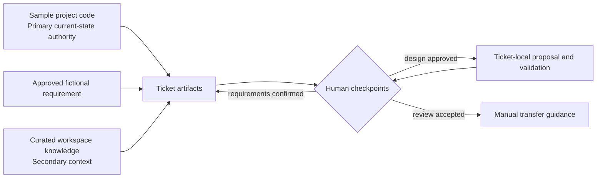
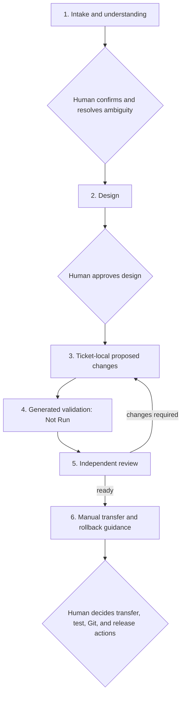

# EngineerOS Demo

EngineerOS is a clean-room portfolio demonstration of evidence-led,
human-controlled AI-assisted engineering. It shows how an agent can understand
an unfamiliar project, trace a fictional requirement, design a small change,
prepare ticket-local proposed files, generate validation, review the work, and
write manual transfer and rollback guidance without silently editing the
authoritative project.

All names, systems, data, rules, thresholds, regions, and tickets in this
repository are synthetic and independently written. Nothing here represents an
employer, client, customer, production environment, or internal system.

## The problem it demonstrates

Coding agents can produce changes quickly, but speed alone does not make work
reviewable or safe. EngineerOS makes the reasoning and control points visible:

- current behavior is grounded in project code;
- facts are separated from inference and assumption;
- ambiguity is resolved by a human before design;
- implementation stays isolated from authoritative source;
- generated tests are not misrepresented as executed evidence;
- an independent review gates release guidance; and
- transfer, execution, source control, and release remain human decisions.

This demonstrates engineering judgment, not autonomous production deployment.

## Repository layout

```text
EngineerOS-Demo/
├── EngineerOS/                         workstation and governance
│   ├── platform/                       source authority and safety rules
│   ├── workflows/                      staged ticket workflow
│   ├── docs/                           architecture and walkthroughs
│   └── workspaces/commerce-risk/
│       ├── knowledge/                  curated secondary context
│       ├── project-code/               source-location manifest only
│       └── tickets/                    templates and DEMO-001 artifacts
├── Sample-Projects/
│   └── commerce-risk/                  authoritative runnable sample source
└── .github/workflows/quality-gates.yml
```

EngineerOS lives alongside project source so more workspaces and projects can be
added without embedding authoritative code inside the workstation.

## Architecture



The source-authority order is project code, approved requirements, official
documentation, curated knowledge, completed-ticket precedent, generated
reference material, then general engineering knowledge. Conflicts are recorded,
not silently reconciled. See [architecture](EngineerOS/docs/architecture.md).

## Human-controlled workflow



The reusable stage prompts are in [WORKFLOW.md](EngineerOS/WORKFLOW.md).

## DEMO-001 walkthrough

The fictional feature request asks for a configurable
`RISK_REPEAT_HIGH_VALUE_ORDERS` rule. During intake, a deliberate ambiguity was
surfaced: whether an order cancelled after completion remains eligible. A human
decided that orders currently marked `CANCELLED` are excluded.

The approved design reuses the existing regional configuration and alert schema,
adds one set-based SQLite evaluator, and avoids a schema migration. Proposed
files remain under the ticket rather than in `Sample-Projects/commerce-risk/`.
Eleven feature tests were generated, an independent review found and resolved
two documentation/coverage gaps, and manual transfer/rollback guidance was
prepared. The proposed files are still `not_transferred`, and generated feature
tests remain `Not Run`.

Start with:

- [Feature request](EngineerOS/workspaces/commerce-risk/tickets/completed/DEMO-001/source/feature-request.md)
- [Task understanding](EngineerOS/workspaces/commerce-risk/tickets/completed/DEMO-001/task-understanding.md)
- [Design](EngineerOS/workspaces/commerce-risk/tickets/completed/DEMO-001/design.md)
- [Independent review](EngineerOS/workspaces/commerce-risk/tickets/completed/DEMO-001/review.md)
- [Manual transfer and rollback](EngineerOS/workspaces/commerce-risk/tickets/completed/DEMO-001/release-and-rollback.md)

## Run the current sample

Requirements: Python 3 with its standard-library `sqlite3` module. No package
installation or external service is required.

From the repository root:

```bash
python EngineerOS/scripts/validate_repository.py
python Sample-Projects/commerce-risk/run_pipeline.py \
  --database /tmp/commerce-risk-demo.db \
  --monitoring-time 2026-01-15T12:00:00Z
```

The current authoritative baseline creates two alerts in the temporary
database. A human can execute its tests with:

```bash
cd Sample-Projects/commerce-risk
python -m unittest discover -s tests -v
```

Generated DEMO-001 validation and evidence-capture instructions are in the
[ticket test guide](EngineerOS/workspaces/commerce-risk/tickets/completed/DEMO-001/tests/README.md).

## Quality gates

The standard-library repository validator checks:

- required completed-ticket artifacts;
- manifest fields, referenced paths, and proposal isolation;
- generated-test `Not Run` evidence labels;
- emails, private/local URLs, credential shapes, and workplace confidentiality
  phrases;
- prohibited document/archive types and nested Git directories; and
- repository-local Markdown links.

Run it with:

```bash
python EngineerOS/scripts/validate_repository.py
```

The [GitHub Actions workflow](.github/workflows/quality-gates.yml) runs this gate
and the authoritative sample-project tests for pull requests and `main` pushes.

## Design tradeoffs and limitations

- SQLite and the Python standard library keep the demo inspectable and portable,
  but do not model production concurrency, scale, or operations.
- The sample rebuilds its database for reproducibility rather than preserving
  history.
- `ordered_at` is used because the compact model has no completion timestamp.
- Missing regional configuration yields no detection, matching current joins.
- Proposed changes require manual transfer; this is deliberate control, not a
  deployment mechanism.
- Static inspection and generated tests are not substitutes for human-executed
  evidence.

## Reviewer routes

- **Five-minute recruiter route:** read this page, run the sample command, then
  scan the [portfolio walkthrough](EngineerOS/docs/portfolio-walkthrough.md#five-minute-recruiter-walkthrough).
- **Fifteen-minute engineer route:** inspect source authority, DEMO-001 design,
  the proposal diff, validation matrix, review, and rollback guidance using the
  [engineer walkthrough](EngineerOS/docs/portfolio-walkthrough.md#fifteen-minute-engineer-walkthrough).

## License

See [LICENSE](EngineerOS/LICENSE).
